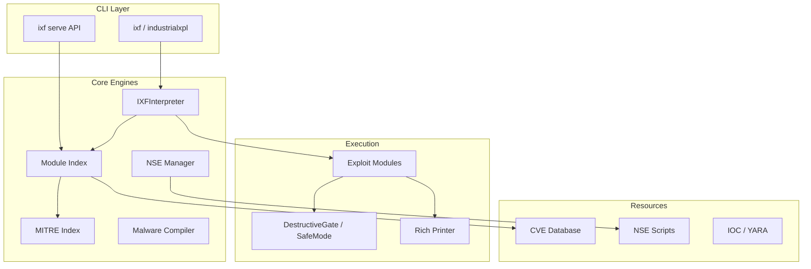
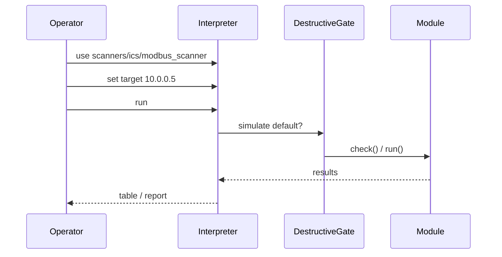

# IndustrialXPL-Forge — Architecture

Official repository: https://github.com/mrhenrike/IndustrialXPL-Forge

## Component diagram



## Data flow



## Module hierarchy

```
industrialxpl/modules/
├── scanners/     discovery & fingerprinting
├── exploits/     protocol / vendor abuse
├── cve/          CVE-specific modules
├── creds/        default credential testing
├── assessment/   MITRE, compliance, SAST, detection
└── encoders/     payload encoders
```

## MITRE ATT&CK for ICS

Run `ixf mitre-coverage` or `use assessment/mitre_ics/coverage_report` for Navigator JSON export.

Gap techniques (issue #1) are covered by `assessment/mitre_ics/gap_technique_coverage`.
